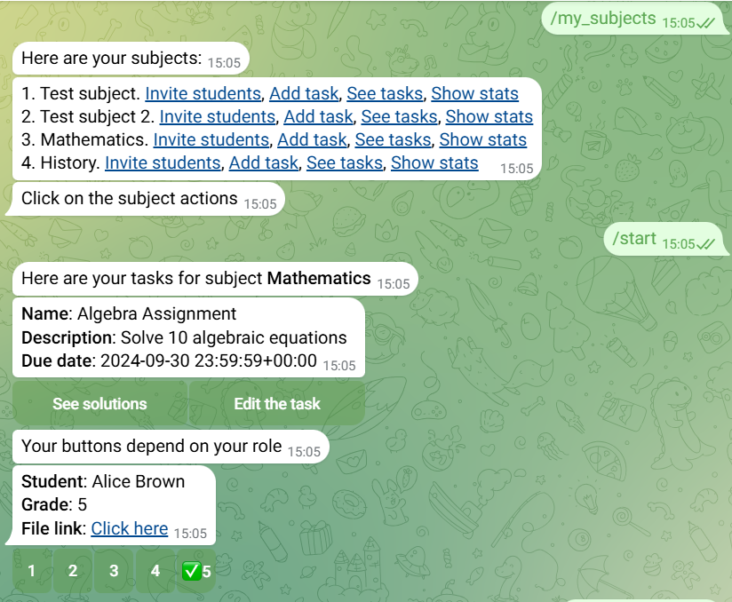

<h1 id="project-title" align="center">
  StudyHelper <br>
  
  
  
  
  
  
  <a href="https://codeium.com">
  
  </a>
</h1>

<p align="center">
 🌟Hello everyone! This is the pet-project as Telegram Bot for education.🌟
</p>

# StudyHelper

It is a Telegram bot that facilitates the learning process. You can read more about it [here](https://dev.to/mezgoodle/studyhelper-my-new-pet-projecttelegram-bot-3f41).

## Functionality

A list of key bot functions:

- Communication between teacher and student through a bot
- Get subject performance statistics
- Sending task solutions

And much more, which you can read about in the article.

## Installation and start

1. Since this is a regular GitHub project, you need to commit it first:

```bash
git clone https://github.com/mezgoodle/StudyHelper.git
```

2. Next, use the package manager **pip** to set dependencies:

```bash
pip install -r requirements.txt
```

3. After that, you need to set some environment variables. You can do this by writing their values to the `.env` file:

```bash
bot_token="<your_bot_token>"
access_id="<your_access_id>"
access_key="<your_access_key>"
```

Also, you have to set up other parameters in the [configuration file](https://github.com/mezgoodle/StudyHelper/blob/main/tgbot/config.py#L11_L13):

- bucket_name
- region_name
- admins

If you want, you can change the name of environment file.

## Example of usage

Here you can see the screenshot of the bot:



More examples can be found in the article on the blog.

## List of commands

A list of available commands, their description and role of the user.

| Command           | Description                        | Role    |
| ----------------- | ---------------------------------- | ------- |
| /start            | Welcome message                    | Anybody |
| /help             | Show the list of commands          | Anybody |
| /cancel           | Reset the state of the bot         | Anybody |
| /register_student | Register as student                | Anybody |
| /register_teacher | Register as teacher                | Anybody |
| /is_teacher       | Check if you are a teacher         | Anybody |
| /is_student       | Check if you are a student         | Anybody |
| /my_subjects      | Show your subjects(for both roles) | Anybody |
| /upcoming_tasks   | Show upcoming tasks                | Student |
| /create_subject   | Create a new subject               | Teacher |

## List of technologies

Here are the main technologies used in the project:

- Python - as a programming language
- aiogram - as a framework for Telegram bots
- boto3 - as a service layer for AWS
- pandas, seaborn - for data analysis and visualization
- tortoise ORM - as a database layer

## Contacts

If you have any questions or suggestions, you can contact me via [Telegram](https://t.me/sylvenis) or [Email](mailto:mezgoodle@gmail.com).
